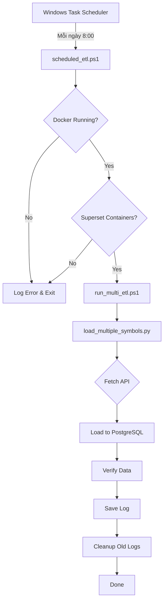

# Hướng Dẫn Tự Động Cập Nhật Dữ Liệu

## 📋 Tổng Quan

Hệ thống tự động cập nhật dữ liệu chứng khoán từ Marketstack API vào Superset database hàng ngày vào lúc 8:00 sáng (hoặc thời gian tùy chỉnh).

## 🎯 Các File Liên Quan

| File | Mô Tả |
|------|-------|
| `scheduled_etl.ps1` | Script chính để chạy ETL tự động (có logging) |
| `setup_scheduled_task.ps1` | Script cài đặt Windows Scheduled Task |
| `remove_scheduled_task.ps1` | Script xóa Scheduled Task |
| `logs/` | Thư mục chứa log files (tự động tạo) |

## 🚀 Cài Đặt Nhanh

### Bước 1: Cài Đặt Scheduled Task

Mở PowerShell **với quyền Administrator** (quan trọng!):

```powershell
# Chạy lệnh này từ thư mục scriptmarketstack
.\setup_scheduled_task.ps1
```

Hoặc tùy chỉnh thời gian:

```powershell
# Chạy lúc 9:30 sáng
.\setup_scheduled_task.ps1 -Time "09:30"

# Chạy lúc 6:00 tối
.\setup_scheduled_task.ps1 -Time "18:00"
```

### Bước 2: Xác Nhận

Script sẽ:
- ✅ Tạo scheduled task tên `MarketstackETL-Daily-Update`
- ✅ Cấu hình chạy hàng ngày vào giờ đã chỉ định
- ✅ Tạo thư mục `logs/` để lưu kết quả
- ✅ Hỏi bạn có muốn test ngay không

## 📊 Kiểm Tra & Quản Lý

### Xem Scheduled Task

1. Nhấn `Win + R`, gõ `taskschd.msc`, nhấn Enter
2. Tìm task tên: **MarketstackETL-Daily-Update**
3. Xem lịch trình, lần chạy cuối, lần chạy tiếp theo

### Test Chạy Thủ Công

**Cách 1: Từ Task Scheduler**
- Chuột phải vào task → **Run**

**Cách 2: Từ PowerShell**
```powershell
Start-ScheduledTask -TaskName "MarketstackETL-Daily-Update"
```

**Cách 3: Chạy trực tiếp script**
```powershell
.\scheduled_etl.ps1
```

### Xem Logs

Logs được lưu trong thư mục `logs/` với format:
```
logs/
  ├── etl_20251218_080001.log
  ├── etl_20251219_080002.log
  └── ...
```

Xem log mới nhất:
```powershell
Get-ChildItem logs\*.log | Sort-Object LastWriteTime -Descending | Select-Object -First 1 | Get-Content
```

## 🔧 Tùy Chỉnh

### Thay Đổi Thời Gian Chạy

Chạy lại script setup với thời gian mới:
```powershell
.\setup_scheduled_task.ps1 -Time "07:00"
```

### Thay Đổi Các Stock Symbol

Chỉnh sửa file [`load_multiple_symbols.py`](file:///d:/LearningCode/CodeLogic/Hethongthongminh/superset/scriptmarketstack/load_multiple_symbols.py#L22):
```python
SYMBOLS = ['AAPL', 'MSFT', 'GOOGL', 'TSLA', 'AMZN', 'META', 'NVDA', 'JPM']
```

### Thay Đổi Số Records Fetch

Chỉnh sửa dòng 98 trong [`load_multiple_symbols.py`](file:///d:/LearningCode/CodeLogic/Hethongthongminh/superset/scriptmarketstack/load_multiple_symbols.py#L98):
```python
df = fetch_market_data(symbol, limit=200)  # Thay đổi từ 100 thành 200
```

### Thay Đổi Số Ngày Giữ Logs

Chỉnh sửa dòng 8 trong [`scheduled_etl.ps1`](file:///d:/LearningCode/CodeLogic/Hethongthongminh/superset/scriptmarketstack/scheduled_etl.ps1#L8):
```powershell
$MaxLogFiles = 60  # Giữ logs 60 ngày thay vì 30
```

## 🗑️ Xóa Scheduled Task

Nếu muốn tắt tự động cập nhật:
```powershell
.\remove_scheduled_task.ps1
```

## 🔍 Troubleshooting

### Task Không Chạy

**Kiểm tra:**
1. Docker Desktop có đang chạy không?
2. Containers Superset có running không?
   ```powershell
   docker ps | Select-String "superset"
   ```
3. Xem log lỗi trong thư mục `logs/`

### Docker Không Chạy

Scheduled task sẽ tự động kiểm tra và báo lỗi nếu:
- Docker không chạy
- Superset containers không running

**Giải pháp:**
- Bật Docker Desktop
- Đợi containers khởi động
- Task sẽ tự động chạy vào lần tiếp theo

### Lỗi Quyền (Permission Denied)

**Nguyên nhân:** Script setup cần quyền Administrator

**Giải pháp:**
1. Chuột phải PowerShell
2. Chọn "Run as Administrator"
3. Chạy lại setup script

### API Rate Limit

Marketstack API miễn phí có giới hạn:
- **1,000 requests/tháng**
- Script hiện tại: 8 symbols × 1 request = 8 requests/ngày
- **8 × 30 = 240 requests/tháng** ✅ An toàn

Nếu cần thêm symbols, tính toán:
```
Số symbols × 30 ngày ≤ 1,000
```

## 📈 Workflow Tự Động



## 📝 Cấu Trúc Log File

Mỗi log file chứa:
- ✅ Thời gian bắt đầu/kết thúc
- ✅ Trạng thái Docker và containers
- ✅ Kết quả fetch cho từng symbol
- ✅ Số records đã load
- ✅ Database verification
- ✅ Thông báo lỗi (nếu có)

## 🎯 Best Practices

### 1. Kiểm Tra Định Kỳ
- Xem logs 1 tuần/lần
- Verify data trong Superset
- Monitoring disk space cho logs

### 2. Backup
Scheduled task sẽ **append** data (không xóa dữ liệu cũ):
```python
df.to_sql(table_name, engine, if_exists='append', index=False)
```

Để xóa và reload hoàn toàn, chỉnh sửa [`load_multiple_symbols.py`](file:///d:/LearningCode/CodeLogic/Hethongthongminh/superset/scriptmarketstack/load_multiple_symbols.py):
```python
# Thêm trước vòng lặp for
clear_existing_data()  # Xóa tất cả data cũ
```

### 3. Monitoring
Tạo alert khi có lỗi (optional):
- Dùng PowerShell send email
- Log vào external monitoring service
- Tích hợp với notification apps

## 🔗 Liên Kết Hữu Ích

- [Marketstack API Documentation](https://marketstack.com/documentation)
- [Windows Task Scheduler Guide](https://learn.microsoft.com/en-us/windows/win32/taskschd/task-scheduler-start-page)
- [PowerShell Scheduled Tasks](https://learn.microsoft.com/en-us/powershell/module/scheduledtasks/)

## 📞 Support

Nếu gặp vấn đề:
1. Kiểm tra log file gần nhất
2. Verify Docker và containers đang chạy
3. Test script thủ công: `.\scheduled_etl.ps1`
4. Kiểm tra API key trong `load_multiple_symbols.py`

---

**Tạo bởi:** Marketstack ETL System  
**Phiên bản:** 1.0  
**Cập nhật:** 2025-12-18
